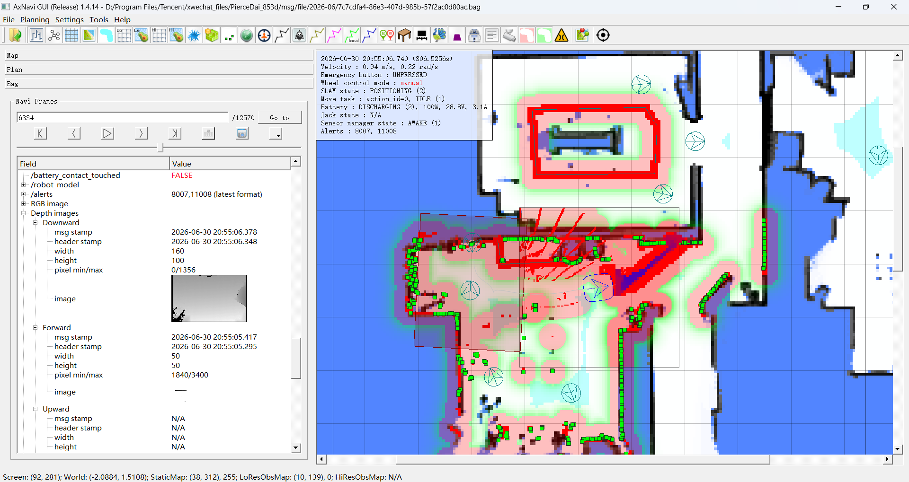

# AxNavi-GUI

The AxNavi GUI is a specialized robotic bag playback tool. It is primarily used by product, testing, and development teams to play back recorded .bag files from robot chassis.



## How to retrieve robot chassis log bag locally?

1. Connect your computer to the WiFi network named after the robot (sn).

The password is 12345678


2. Access via browser: http://192.168.12.1:8090/rb-admin/

```
user: guest@autoxing.com
pwd: autoxing
```


3. Locate the log list under the control menu and download the bag according to the issue time.


## How to analyze bag logs

- Open the repository on local disk. 
Note: Avoid including Chinese characters in the full path (on some machines, Chinese characters in the path may cause the app to crash when opening the file)

- Run ax_navi_gui.bat (NOT ax_navi_gui.exe !!)

- Open the downloaded bag file in AxNavi GUI

- To activate the RGB camera, set the AX_NAVI_GUI_SECRET environment variable and restart AxNavi GUI